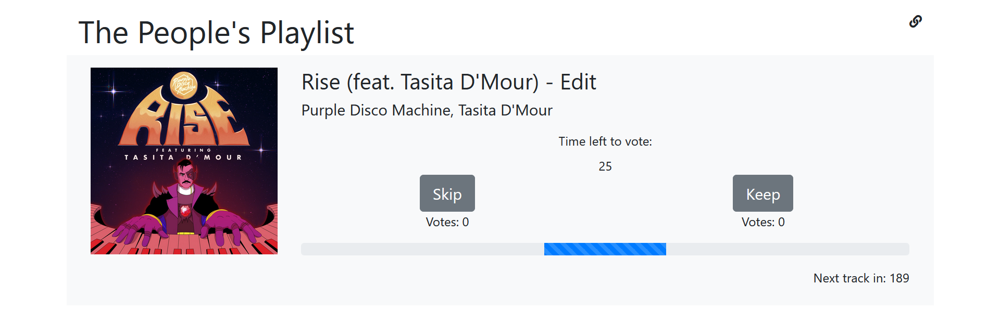
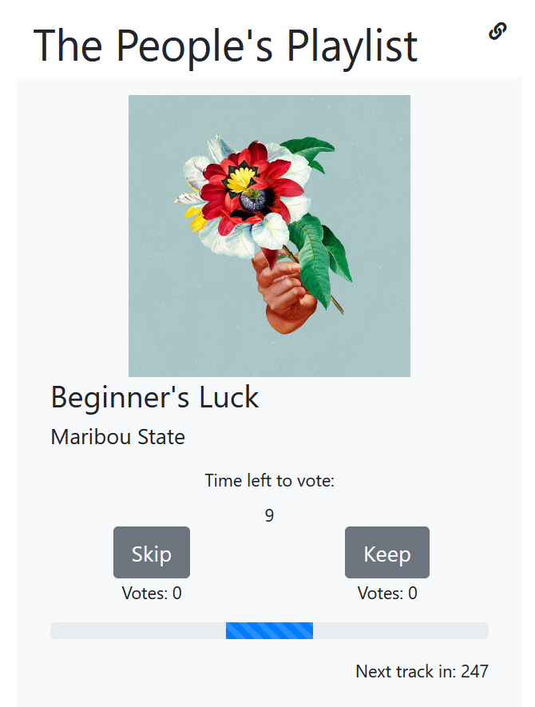

# The People's Playlist

The Peoples Playlist is a Python3 web app that controls a Spotify player. It is used at a party, to give the people there a little bit of control over the playlist. In short, it lets those people, at specific points, decide if the next track is to be played or skipped.

## What does it look like?

### Desktop view

### Mobile view

## How does it work?

It used [flask-socketio](https://flask-socketio.readthedocs.io/) to allow for instant updates between server and client. Websockets are used to mean updates are processed very quickly, meaning the voting is fairly fluid. :)

## Get it running

### Spotify

You will need to register an app at [the Spotify developers site](https://developer.spotify.com/) Get the client id and client secret, specify a callback url (which will be something like `https://<ip>/spotify`) and pass them as environment variables.

### Docker

The recommended way to deploy is via container. Take the Docker Compose file, modify it to include your Spotify config, and then run it. 

    docker-compose -f docker-compose.yml up

It will then be available at port 5000 by default. If you are running it on your local machine, it is `http://localhost:5000`. Note it will run across the network by default.

### Configuration
You can see the (limited) number of configuration options in [default_config.py](default_config.py). To change the defaults, set an environment variable prefixed with `FLASK_` prefix.  For example, to set the debug level to DEBUG and get more logging, you would run `export FLASK_DEBUG_LEVEL=DEBUG`

### Log in to Spotify

Once you can connect to the front-end, navigate to `https://<ip>/spotify` in your browser. Then log in. Then play something, and the standard front end should show it! Note that your party guests don't need to do this; only the person who is playing the music.

## Development, or local install

### Dependancies
Python 3, plus the modules in requirements.txt

### How to run a development server
Assumption is a Ubuntu machine.

Create your virtual environment

    python3 -m venv venv
    source venv/bin/activate

Install the dependancies:

    pip3 install -r requirements.txt

Set the variables:

    export SPOTIPY_CLIENT_ID="<client id>"
	export SPOTIPY_CLIENT_SECRET="<client secret>"
    export SPOTIPY_REDIRECT_URI=http://<ip>:5000/spotify/'
    export FLASK_DEBUG=true

Execute:

    python3 web_app/app.py

### Code standards

Auto-formatting is achieved using Black:

    python3 -m black .

And making sure you follow PEP 8 is done with Flake8, with the adjustments that Black recommend.

    python3 -m flake8 .